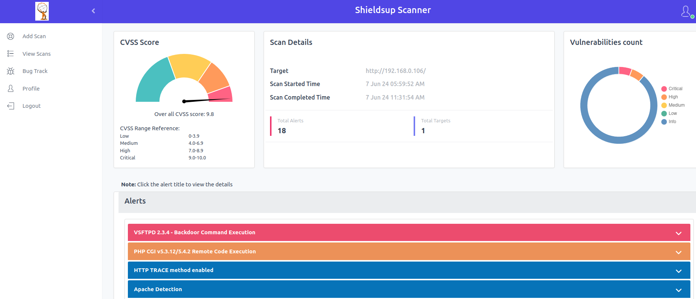

# ShieldsUp Scanner Manual

## Accessing the Panel

On your desktop, open a browser (Firefox or Chrome, recommended: Firefox) and enter the following address.
https://localhost:8443

- You will get a self-signed certificate error message.  Click the `Advanced` button and then click the `Accept the Risk and Continue` button.


- Then, the panel with show the user account creation page. Fill out the form with username, password, and email address. 

Note: The email address is just for user creation. It is not used or uploaded to any external server.


 
- Once created you will get a login page, you can provide the username and password to log in. Once logged in, you can see the ShieldsUp Scanner home page.


## How to scan the target?

### Pre-requisites

Before you begin, make sure you have the target URL/IP/IP Range and ensure it is accessible from the virtual machine IP.

### Steps

### 1. Login

- Open a web browser and navigate to the ShieldsUp Scanner Panel.
- Enter your login credentials to access your account.

### 2. Go to the Add Scan page

- From the side menu, locate and click on the `Add Scan` option. This will take you to the `Add Scan` page.
- Enter the target URL/IP/IP range.


### 3. Add the target

- Click on `Add` to submit the target URL/IP. Once added successfully, it will display the `success` message.


## View Scans

- In this menu, you can view the scan reports and alerts, and also you can delete the scan.


Each row represents a specific target and includes the following information:

**Target**

- Displays the added scan URL or IP or IP range.    

**Status**

Displays the status of the scan.
    
- **Yet to start:** Denotes that the scan has not started yet.

- **Scan started:** Denotes that the scan has started.

- **Report generated:** Denotes that the scan has been completed and the report generated.

- **Scan Failed:** Denotes that the scan failed due to an error.

**Action**

&nbsp; During the scan, the ShieldsUp Scanner identifies vulnerabilities in the target.
    
&nbsp;&nbsp;&nbsp;&nbsp; Under this menu, there are three options: Report, Alerts, and Delete.
    

***Report:***

After the scan is complete, click on the `Report` button to download the report.


The generated report includes the following details
- Overall CVSS score, Severity level.
- Executive summary which gives a summary of the scan results. Also, it provides key points to mitigate the vulnerability, overall risk assessment, and recommendations.
- CVE, CVSS metrics
- Remediations and References.

***Alerts:***
    
Click on the `Alerts` option to display in the panel itself the vulnerability details generated by the ShieldsUp Scanner. In the Alerts window, you will see a detailed presentation of the CVSS score chart, scan details, and the count of vulnerabilities.

The vulnerabilities are listed according to their severity level which can be critical, high, medium, low, and info.



> Note: Click the alert title to view the details.

You can add the vulnerabilities to BugTrack by clicking on the `Add to BugTrack` option. Through BugTrack, you can track the vulnerability, and prioritize and fix the vulnerabilities.


Edit entries like severity, impact, remediations, remarks, and all, and then Click on `Add` to add the vulnerability to BugTrack.


Once added, it will display a `success` message.

***Delete:***

To delete the scan, you can click on `Delete` and click on `OK` in the banner to confirm the deletion.


Once deleted, it will display a `success` message.


## BugTrack

In this menu, you can view and track the vulnerabilities list that was added previously.

You can export the BugTrack in an Excel sheet by clicking on `Export Bugs` on the top left.


    

### Action:

To update or view details of the BugTrack, click on the `Details` option. Modify the entries as needed and click on `Update` to save the changes.


To delete the BugTrack entry, click on the `Delete` option.


Once deleted, it will display a `success` message.

## Profile
    
You can view your profile information which includes name, username, and email address.


## Logout

You can click on the `logout` option to successfully logout from the panel.

## Forgot Password

- In case of a forgotten password you will need to destroy and rebuild the VM per the below step. And then go through the setup again.

 ```
 vagrant destroy shieldsup-oss
 ```
